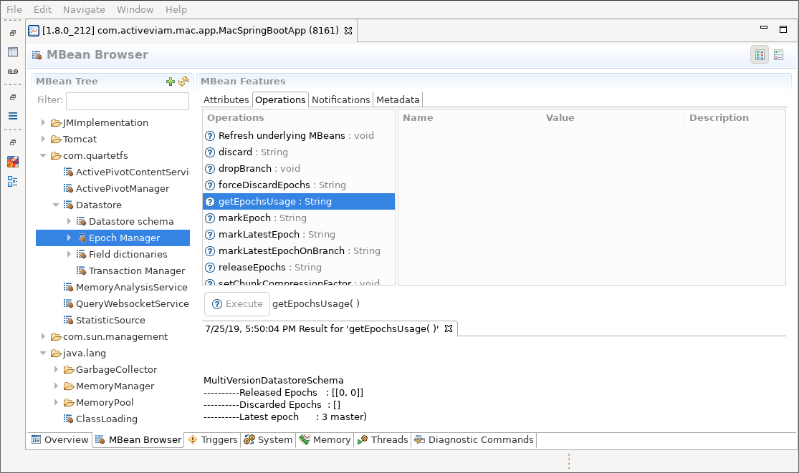

# Exporting Data from an ActivePivot Application

The exporting of an ActivePivot application is done through an
`IMemoryAnalysisService`.

This service can be instantiated
[programmatically](#export-memory-reports-programmatically), or exposed by
setting up a [JMX Bean](#export-memory-reports-through-an-mbean).

## Export Memory Reports Programmatically

The basic implementation of `IMemoryAnalysisService` is `MemoryAnalysisService`.
It can be instantiated through its constructor, passing the Datastore and
ActivePivot Manager we want to export.

```java
new MemoryAnalysisService(
    datastore,
    manager,
    datastore.getEpochManager(),
    exportPath);
```

All reports will be exported in a sub-folder inside the specified `exportPath`.

The `IMemoryAnalysisService` then provides a number of methods for generating
memory reports:
* `exportMostRecentVersion(String)`: exports the application based on the
  current epoch
* `exportApplication(String)`: exports all versions of the application
* `exportBranches(String, Set<String>)`: exports the heads of all specified
  branches
* `exportVersions(String, long[])`: exports the application for all specified
  epoch ids

The first string argument of these methods is the name of the sub-directory the
report should be stored in. Each method returns the `Path` of the exported report.

## Export Memory Reports through an MBean

### MBean Definition

The `IMemoryAnalysisService` can be created and exposed through a JMX MBean,
using the following snippet:
```java
@Bean
public JMXEnabler JMXMemoryMonitoringServiceEnabler() {
    final IDatastore datastore;
    final IActivePivotManager manager;
    return new JMXEnabler(
        new MemoryAnalysisService(
            datastore,
            manager,
            datastore.getEpochManager(),
            Paths.get(System.getProperty("java.io.tmpdir"))));
}
```

In the above code, we created a new service using the application Datastore and
ActivePivot Manager. We also specified the directory of the export folder as the
OS `temp` directory. All generated reports will be created inside that directory
as sub-folders.

The implementation `MemoryAnalysisService` is MBean friendly and will
automatically name itself as *MemoryAnalysisService*.

### Generating the Report

To export a new report, connect to your application using your favorite MBean
browser. In this guide, we will be using Java Mission Control. Alternatives are
JConsole or JVisualVM - which are proprietary software of Oracle - or the
open-sourced VisualVM.

In the MBean folder *com.quartetfs*, you will see the MBean
*MemoryAnalysisService*.


The attribute `JmxDumpFolder` corresponds to the path to the service's export directory, in
case you are unaware of the application configuration.

Within the operation screen, you have the ability to export a report for the
entire application - see the following screenshot - or for a selected range of
epochs. Exporting a range allows exporting only the memory required for a given
epoch or series of epochs. Exporting the whole application helps detect how
much memory is truly retained (very handy for spotting objects leaking memory).

#### Full Export

When exporting the whole application, you are asked to provide a name for the
export. This name is used to create a sub-folder inside the application export
directory. The result of the operation call tells us exactly where the report is
located.

For our example, we want to generate a report in the folder *export-1*, that
will be located under */tmp/export-1*.

In case we already have a folder *export-1*, the application will add a
timestamp at the end of the specified folder name.


#### Version Export

Doing an export of the application for a range of epochs is very similar to
doing the full application export. In addition to the export folder, the list of
epochs to export needs to be specified.

This list is a comma-separated list of ranges. A range can be one of the
following:

 - a single value like `1`, that will export Epoch 1,
 - a range like `1-3`, that will export Epochs 1, 2 and 3

For example, the epoch list `1,4-6,9` represents Epochs 1, 4, 5, 6 and 9.

In our example, we export Epochs 1, 2 and 3 into *export-2*.


To get a list of the available epochs, various MBeans exist. For example, you
can go to the Epoch Manager and look at the epoch usage.


