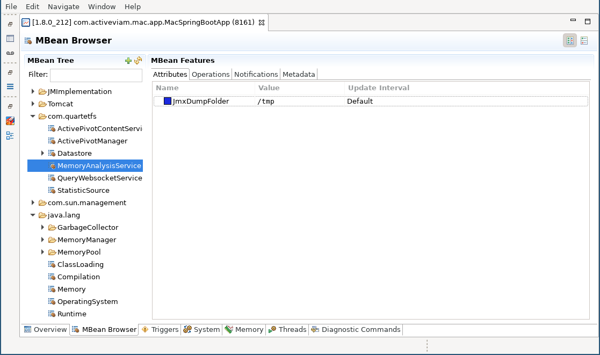
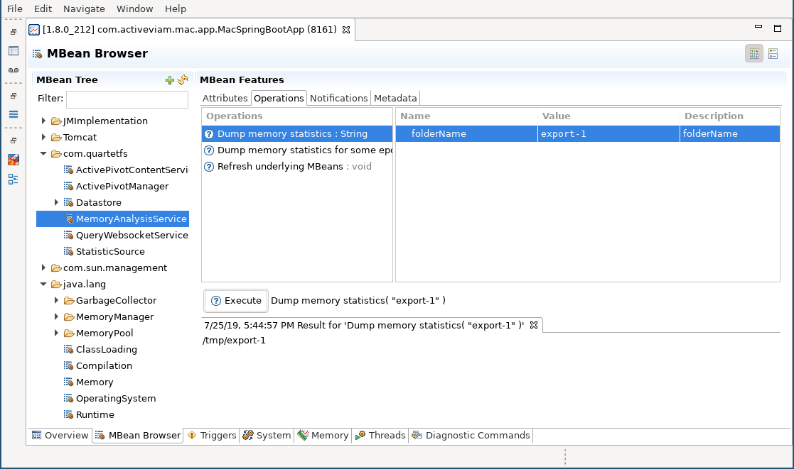
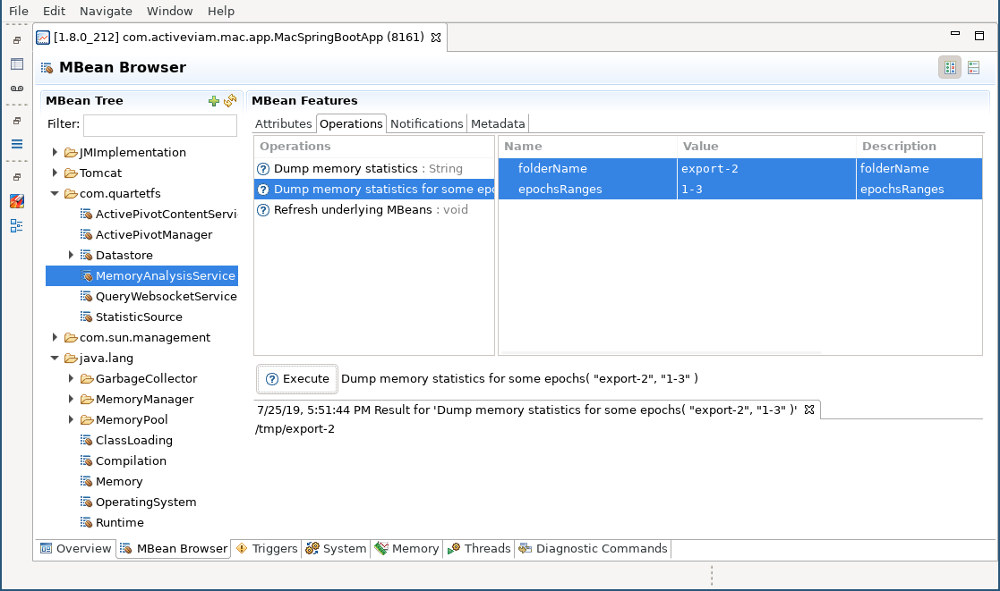
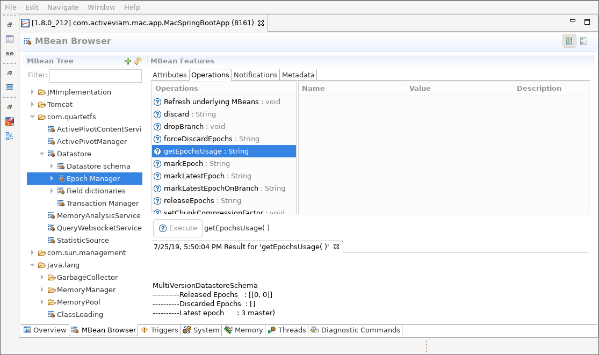
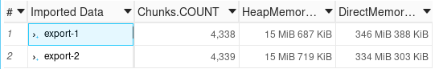

Exporting data from an ActivePivot application
==========================

Prepare your application
------------

To be able to export data from an ActivePivot application, you must instanciate an `IMemoryAnalysisService`.  
In this guide, we will assume that the service is created and exposed as a JMX MBean, using the following snippet:

```java
@Bean
public JMXEnabler JMXMemoryMonitoringServiceEnabler() {
    final IDatastore datastore;
    final IActivePivotManager manager;
    return new JMXEnabler(new MemoryAnalysisService(
            datastore,
            manager,
            datastore.getEpochManager(),
            Paths.get(System.getProperty("java.io.tmpdir"))));
}
```

In the above code, we created a new service using the application Datastore and ActivePivot Manager. We also specified 
the directory of the export folder as the OS temp directory. All generated reports will be created inside that
directory as sub-folders.

The implementation `MemoryAnalysisService` is MBean friendly and will automatically name itself as 
_MemoryAnalysisService_.

Export memory reports using the MBean
-------------

To export a new report, connect to your application using your favorite MBean browser. In this guide, we will be using
Java Mission Control7. Alternatives are JConsole or JVisualvm - which is proprietary software of Oracle - or
VisualVM - now open-sourced.

In the MBean folder _com.quartetfs_, you will see the MBean _MemoryAnalysisService_.

Inline-style: 


The service exposes again the path to its export directory, in case you are unaware of the application configuration.

Within the operation screen, you have the ability to export a report for the entire application - see the following 
screenshot - or for a selected range of epochs. Exporting a range allows exporting only the memory required for a given 
epoch or series of epochs. Exporting the whole application helps detect how much memory is truly retained, often
by objects leaking memory.

When exporting the whole application, you are asked to provide a name for the export. This name is used to create a
sub-folder inside the application export directory. The result of the operation call tells us exactly where the report 
is located.  
For our example, we request a folder _export-1_, that will be located under _/tmp/export-1_.

In case we already have a folder _export-1_, the application will add the current timestamp at the end of the 
specified folder name.



Exporting a range of epochs is very similar. In addition to the export folder, you must specify the list of epochs
to export.

This list is a comma-separated list of ranges. A range can be one of the following:

 - a single value like `1`, that will export Epoch 1,
 - a range like `1-3`, that will export Epochs 1, 2 and 3
 
Your input can then be `1,4-6,9`, meaning that Epochs 1, 4, 5, 6 and 9 will be exported.

In our example, we export Epochs 1, 2 and 3 into _export-2_.



To get a list of the available epochs, various MBeans exist. For example, you can go to the Epoch Manager and 
look at the epoch statistics.

 


Exported data
-------

Currently, each export method exports every component of an application. These reports are split into Stores and 
ActivePivots. Store statistics are exported in files prefixed by `store_` and named after the stores. ActivePivot 
statistics are exported in files prefixed by `pivot_` and named after the ActivePivot ids.  
Exported files are currently compressed using [snappy](https://en.wikipedia.org/wiki/Snappy_(compression)). If so,
the file extension is suffixed by `.sz`.

As an example, in the case of the sandbox application, we have the following exported files:

 - pivot_EquityDerivativesCubeDist.json.sz
 - pivot_EquityDerivativesCubeEURGBP.json.sz
 - pivot_EquityDerivativesCube.json.sz
 - store_City.json.sz
 - store_CounterParty.json.sz
 - store_Desk.json.sz
 - store_Forex.json.sz
 - store_Parameters.json.sz
 - store_Product.json.sz
 - store_Risk.json.sz
 - store_Trade.json.sz

**Each file contains all the information for a complete loading in the MAC application.** Therefore, it is possible
to only import the reports for one ActivePivot, or a selection of stores.

Importing data into MAC
--------------

By default, in the configuration, the MAC application will look for a directory named _statistics_ in the current
working directory. Every file containing `.json` will be considered as containing memory statistics and will be loaded.
The pattern matches both a decompressed file, such as _store_Trade.json_ as well as a compressed entry, such as
_store_Risk.json.sz_.

If files are found in a directory under _statistics_, MAC will use the directory name to tag the imported data.
Otherwise, the import is tagged with a generated name following the format `autoload-<datetime>`.  
For example, with the following data inside statistics:

```
statistics
 |- export-1
 |  |- store_Trade.json.sz
 |  '- store_Risk.json.sz
 '- export-2
    |- store_Trade.json.sz
    '- store_Risk.json.sz
```

MAC will load two batches of data tagged with _export-1_ and _export-2_. The two batches can now be compared in the UI
using the hierarchy _Imported Data_.



### Automatic loading

MAC is monitoring the directory _statistics_ for any changes. If you add a new directory or new files in the directory,
they will be automatically loaded. This allows loading reports in several operations, dynamically add a new report
without restarting the application or update already imported reports.
